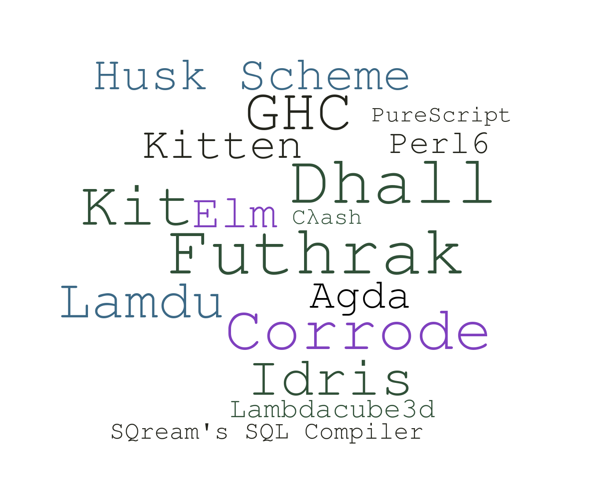

# Compilers and

[](https://haskell.org)

---

## Haskell

Haskell is a versatile, general purpose programming language, and can be used to build many kinds of applications

- Scripts ([Turtle](http://hackage.haskell.org/package/turtle))
- Web servers and frontend applications ([Yesod](https://www.yesodweb.com/), [Servant](https://haskell-servant.github.io/), [Miso](https://haskell-miso.org/), [Reflex](https://github.com/reflex-frp/reflex-platform) and many more)
- Build systems ([Shake](http://shakebuild.com/))
- Games ([Nyx](https://gilmi.me/nyx))
- [More](https://github.com/Gabriel439/post-rfc/blob/master/sotu.md)

---

## Compilers

In particularily, Haskell is really good for writing compilers and interpreters.



---

## Outline

In this talk we'll talk a bit about the implementation of compilers and interpreters,
And what Haskell can offer us as compiler writers.

---

## Compilers as a Pipeline

```hs
--                                                   Syntax
                  ---------   Tokens    ----------    Tree     --------------------    IR*    -----------
 Source Code ---> | Lexer | ----------> | Parser | ----------> | Transformations* | --------> | CodeGen | ---> Target Code
                  ---------             ----------             --------------------           -----------
```

1. Transformations*:
    - Simplification
    - Static Analysis
    - Optimizations
    - Etc.
2. IR*:
    - You can have 0 or many Intermediate Representations

---

## Functional Programming as a Pipeline

```hs
compile :: SourceCode -> TargetCode
compile = lex >>> parse >>> rewrite >>> generateCode

-- or alternatively: generateCode . rewrite . parse . lex
```

---

## The Inner Parts

---

## Defining a Language

We define the syntax of a language (grammar) using BNF* as a meta language.

```hs
<program> ::= <statement> ...

<statement> ::=
    <expr>";"
  | <decl>";"
  | <block>";"

<decl> ::= "def" <name> "=" <expr>";"

<block> ::= "{" <statement>; ... "}"

<expr> ::=
    <value>
  | <name>
  | <name> (<expr>*)

<value> ::=
    "true"
  | "false"
  | <char>
  | <integer>
  | <string>
  | "{"<struct>"}"
```

---

## Representation

How do we represent this language as code?

---

## Syntax Trees

- We often use a tree data structure called syntax trees to represent source code.

- Abstract syntax trees (ASTs for short) let us represent the essence of it.

- ASTs are independant of the concrete syntax of the language and removes the syntactic noise out of the source code such as unnecessary parenthesis, semicolons, operator precedence, etc.

Algebraic Data Types are great for defining Syntax Trees.

---

## Parallels

```hs
--- Haskell ---                        --- BNF ---

data Statement                         <statement> ::=
  = Expr Expr                              <expr>;
  | Decl Name Expr                       | def <name> = <expr>;
  | Block [Statement]                    | { <statement>; ... };

data Expr                              <expr> ::=
  = Value Value                            <value>
  | Var Name                             | <name>
  | App Name [Expr]                      | <name> (<expr>, ...)

data Value                             <value> ::=
  = True'                                | "true"
  | False'                               | "false"
  | Char Char                            | <char>
  | Int Integer                          | <integer>
  | String Text                          | <string>
  | Struct [(Name, Value)]               | "{"<name> = <value>, ..."}"
```

---

## Lexing

We define the nitpicking of our syntax - reserved words, identifiers, literals, punctuation, comments, etc.

```hs
spaceConsumer :: Prs.Parser ()
spaceConsumer = Lex.space (void Prs.spaceChar) lineCmnt blockCmnt
  where
    lineCmnt  = Lex.skipLineComment "//"
    blockCmnt = Lex.skipBlockComment "/*" "*/"

lexeme :: Prs.Parser a -> Prs.Parser a
lexeme = Lex.lexeme spaceConsumer

symbol :: T.Text -> Prs.Parser T.Text
symbol = fmap T.pack . Lex.symbol spaceConsumer . T.unpack

-- | 'integer' parses an integer
integer :: Prs.Parser Integer
integer = lexeme (Lex.signed spaceConsumer Lex.integer)

-- | strings
string :: Prs.Parser T.Text
string = fmap T.pack (Prs.char '"' >> Prs.manyTill Lex.charLiteral (Prs.char '"'))

-- | char
char :: Prs.Parser Char
char = Prs.char '\'' *> Lex.charLiteral <* Prs.char '\''

rword :: T.Text -> Prs.Parser ()
rword w = Prs.string (T.unpack w) *> Prs.notFollowedBy Prs.alphaNumChar *> spaceConsumer

-- | list of reserved words
reservedWords :: [T.Text]
reservedWords = ["var"]

-- | identifiers
identifier :: Prs.Parser T.Text
identifier = lexeme (p >>= check . T.pack)
  where
    p = (:) <$> idCharStart <*> Prs.many idCharRest
    idCharStart = Prs.letterChar
    idCharRest  = Prs.alphaNumChar <|> Prs.oneOf ("!@#$%^&*-=/_" :: String)
    check x
      | x `elem` reservedWords =
        fail $ "keyword " ++ show x ++ " cannot be an identifier"
      | otherwise pure x

parens, braces, angles, brackets :: Prs.Parser a -> Prs.Parser a
parens    = Prs.between (symbol "(") (symbol ")")
braces    = Prs.between (symbol "{") (symbol "}")
angles    = Prs.between (symbol "<") (symbol ">")
brackets  = Prs.between (symbol "[") (symbol "]")

semicolon, comma, colon, dot, equals :: Prs.Parser T.Text
semicolon = symbol ";"
comma     = symbol ","
colon     = symbol ":"
dot       = symbol "."
equals    = symbol "="
```

---

## Parsing

Convert concrete syntax to an abstract syntax tree.

We can use a parser combinators library in Haskell that have a fairly declarative API for defining parsers.

```hs
program :: Prs.Parser Program
program = Prs.many statement <* Prs.eof

statement :: Prs.Parser Statement
statement =
      (decl <* semicolon)
  <|> ((Expr <$> expr) <* semicolon)
  <|> ((Block <$> braces (Prs.many statement)) <* semicolon)

decl :: Prs.Parser Statement
decl = rword "def" *>
  ( Decl
    <$> identifier
    <*> (equals *> expr)
  )

expr :: Prs.Parser Expr
expr =
      (Value <$> value)
  <|> Prs.try (App <$> identifier <*> parens (Prs.sepBy expr comma))
  <|> (Var <$> identifier)

value :: Prs.Parser Value
value =
      (VTrue  <$  rword "true")
  <|> (VFalse <$  rword "false")
  <|> (Char   <$> char)
  <|> (Int    <$> integer)
  <|> (String <$> string)
  <|> (Struct <$> brackets (Prs.sepBy ((,) <$> identifier <*> (equals *> value)) comma))
```

---

# Transformations

###### We rewrite ASTs to make them simpler, more explicit or more efficient.

---

## Transformations - Examples

#### Desugaring
Desugaring is a process of converting some constructs to other constructs.

For example: rewrite `where` to `let` expressions in Haskell

---

## Transformations - Examples

#### A-Normalization
A-normalization is a way of sequentializing computation in an explicit order.

For example: rewrite `f x + g x` to:

```hs
let
  r1 = f x
  r2 = g x
in
  (+) r1 r2
```

(This is called A-normal form, or ANF in short)

---

## Transformations - Examples

#### Constant Folding
Constant folding is a way of reducing computations that can be calculated at compile time.

For example: rewrite `3 + 4 + x` to `7 + x`

---

## Operational Semantics

Describes the meaning of code.

- Small-step semantics: take an expression and reduce it one further step
- Big-step semantics: take an expression and reduce it all the way

Example for big step semantics:

```hs
  e1 ⇓ n    e2 ⇓ m
--------------------
  e1 + e2 ⇓ n + m
```

---

#### Operational Semantics and Pattern Matching

- We can use pattern matching and recursion to decide how to transform or reduce each expression.
- Notice the recursion!

```hs
data Expr
  | Value Int
  | Add Expr Expr
  | Mul Expr Expr
  | Sub Expr Expr
  | Div Expr Expr

eval :: Expr -> Int
eval expr = case expr of
  Value i ->
    i

  Add e1 e2 ->
    let
      n = eval e1
      m = eval e2   --    e1 ⇓ n    e2 ⇓ m
    in              --   -------------------
      n + m         --     e1 + e2 ⇓ n + m
                     
  Mul e1 e2 ->
    eval e1 * eval e2

  Sub e1 e2 ->
    eval e1 - eval e2

  Div e1 e2 ->
    eval e1 / eval e2
```


---

#### Pattern Matching and Constant Folding

```hs
data Expr
  | Value Int
  | Var String
  | Add Expr Expr

constantFolding :: Expr -> Expr
constantFolding expr = case expr of
  Add e1 e2 ->
    case (constantFolding e1, constantFolding e2) of
      (Value 0, r) -> r
      (r, Value 0) -> r
      (Value n, Value m) -> Value (n + m)
      (r1, r2) -> Add r1 r2

  _ -> expr
```

---

## Code Generation

Is very similar to reduction, but instead of reducing to a value we emit strings or binary.

Translate your AST to an AST that represents your target language, then using pattern matching and recursion to pretty print it.

```hs
data JSExpr
  = JSInt Int
  | JSSymbol Name
  | JSBinOp JSBinOp JSExpr JSExpr
  | JSLambda [Name] JSExpr
  | JSFunCall JSExpr [JSExpr]
  | JSReturn JSExpr

printJSExpr :: Bool -> Int -> JSExpr -> String
printJSExpr doindent tabs = \case
  JSInt i -> show i
  JSSymbol name -> name
  JSLambda vars expr -> (if doindent then indent tabs else id) $ unlines
    [ "function(" ++ intercalate ", " vars ++ ") {"
    , indent (tabs+1) $ printJSExpr False (tabs+1) expr
    ] ++ indent tabs "}"

  JSBinOp  op e1 e2  -> concat
    [ "(" , printJSExpr False tabs e1 , " " , printJSOp op , " " , printJSExpr False tabs e2 , ")"]

  JSFunCall f exprs  -> concat
    [ "(" , printJSExpr False tabs f , ")(" , intercalate ", " (fmap (printJSExpr False tabs) exprs) , ")"]

  JSReturn expr -> (if doindent then indent tabs else id)
    $ "return " ++ printJSExpr False tabs expr ++ ";"
```

---

## Going Beyond

These are the basics of using Haskell and compilers, but there are many more ideas Haskell brings to the table for writing compilers!

- Monad transformers for all kinds of effects (symbol tables with `Reader`, fresh variables with `State`, error reporting with `Except`, etc.)
- Recursion schemes and `uniplate` to make transformations easier
- "Trees That Grow" to make ASTs more extendable
- Cofree to attach and detach annotations to an AST
- GADTs to make ASTs more type safe
- `bound` and other libraries to reduce repetitive work regarding names of things

---

## Things That (IMO) Will Make Haskell Even Better For Compilers

- Easier way to extend or constrict ADTs than "Trees that grow" (This ADT is the same as that ADT but without the `Sub` constructor)
- Extensible records / row polymorphism - add/remove annotations, refer to part of the annotation
- Polymorphic variants - different operations on ASTs can throw different kind of errors which are all easily composable

---

## How to Get Started with Compilers and Haskell?

- [Compiling Lisp to JavaScript From Scratch in 350 LOC](https://gilmi.me/blog/post/2016/10/14/lisp-to-js)
- [Write You a Scheme](https://wespiser.com/writings/wyas/00_overview.html)
- [Implementing a JIT Compiled Language with Haskell and LLVM](http://www.stephendiehl.com/llvm/)
- [Implementing Programming Languages](https://www.amazon.com/Implementing-Programming-Languages-Introduction-Interpreters/dp/1848900643)
- [Fun Compilers](https://github.com/soupi/rfc/blob/master/fun-compilers.md)

---

# Questions?

---

# Thanks!

If you want to contact me or read more about Haskell stuff I've written,

visit my website: [gilmi.me](https://gilmi.me)

---
